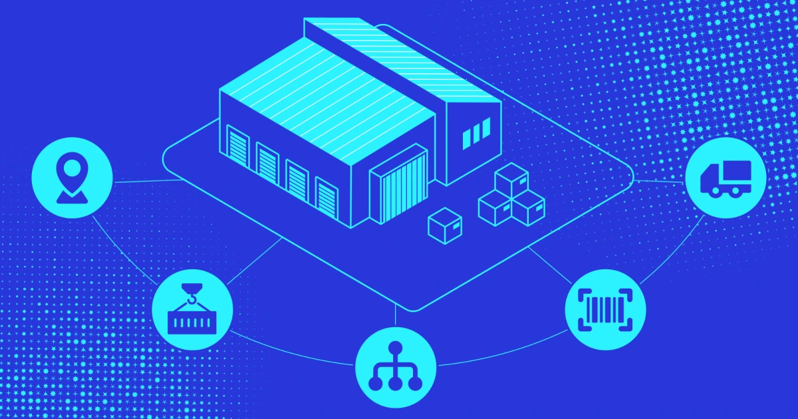
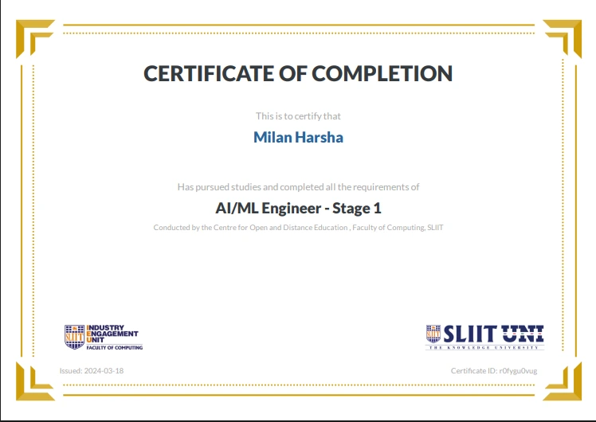

# Milan Harsha Portfolio


A modern, responsive personal portfolio website for **Milan Harsha**, an ICT undergraduate passionate about **Cloud Computing**, **DevOps**, **Full Stack Development**, and modern software engineering.

This portfolio highlights education, skills, professional experience, featured projects, certificates, and contact information through a polished React interface with animations, dark mode, and smooth section navigation.

## 🌐 Live Demo

🚀 **Live Site:** [https://milanalgama.github.io/Milan-Algama/](https://milanalgama.github.io/Milan-Algama/)

> The Vite base path is configured as `/Milan-Algama/` for GitHub Pages deployment.

## ✨ Features

- 🎯 Professional hero section with animated role text
- 🌓 Dark and light theme toggle with local storage persistence
- 🧭 Smooth scrolling navigation using `react-scroll`
- 🎨 Animated UI sections powered by Framer Motion
- 🌌 Gradient background, floating blobs, orbit effects, and particle-style visuals
- 📱 Fully responsive layout for mobile, tablet, and desktop screens
- 🧑‍🎓 Education, skills, experience, certificates, and projects sections
- 💼 Featured project cards with screenshots and GitHub links
- 📬 Contact section with email, phone, location, GitHub, LinkedIn, and mail form
- ⚡ Fast Vite build setup with ESLint support
- 🚀 GitHub Pages-ready deployment configuration

## 🛠️ Technologies Used

### Frontend

- React 19
- Vite 8
- Tailwind CSS 4
- JavaScript ES Modules
- HTML5
- CSS3

### UI, Animation, and Icons

- Framer Motion
- React Icons
- Heroicons
- React Scroll
- React Type Animation
- tsParticles

### Tooling and Deployment

- ESLint
- npm
- Git
- GitHub
- GitHub Actions
- GitHub Pages

## 📸 Screenshots

Add final full-page screenshots inside a `docs/screenshots/` folder and update the paths below when available.

| Section      | Preview                             |
| ------------ | ----------------------------------- |
| Hero / Home  | `docs/screenshots/home.png`         |
| Projects     | `docs/screenshots/projects.png`     |
| Certificates | `docs/screenshots/certificates.png` |
| Contact      | `docs/screenshots/contact.png`      |

Existing project visuals used in the portfolio:

| Asset                       | Preview                                                         |
| --------------------------- | --------------------------------------------------------------- |
| Sales Management System     |       |
| Logistics Management System |   |
| AI/ML Certificate           |  |

## 🚀 Getting Started

Follow these steps to run the project locally.

### Prerequisites

- Node.js 20 or newer recommended
- npm
- Git
- MongoDB running locally or a MongoDB Atlas connection string

### Frontend Installation

```bash
git clone https://github.com/MilanAlgama/Milan-Algama.git
cd Milan-Algama
npm install
```

### Backend Installation

```bash
cd backend
npm install
```

### Configure Environment Variables

Create a file named `.env` inside the `backend` folder with:

```env
PORT=5000
MONGO_URI=mongodb://127.0.0.1:27017/portfolio-db
```

If you use MongoDB Atlas, replace the URI with your Atlas connection string.

### Run the Backend

```bash
cd backend
npm run dev
```

The API will be available at:

```text
http://localhost:5000/
```

### Run the Frontend

In a separate terminal:

```bash
cd ..
npm run dev
```

Open the local URL shown in the terminal, usually:

```text
http://localhost:5173/
```

### Build for Production

```bash
npm run build
```

### Preview Production Build

```bash
npm run preview
```

### Lint the Project

```bash
npm run lint
```

## 📁 Project Structure

```text
Milan-Algama/
├── backend/
│   ├── config/
│   │   └── database.js
│   ├── controllers/
│   │   └── projectController.js
│   ├── middleware/
│   │   └── errorHandler.js
│   ├── models/
│   │   └── Project.js
│   ├── routes/
│   │   └── projectRoutes.js
│   ├── .env
│   └── server.js
├── public/
│   ├── Projects/
│   │   ├── LMS-ui.webp
│   │   └── POS-ui.webp
│   ├── certificates/
│   │   └── AIML-certificate.webp
│   └── icons.svg
├── src/
│   ├── assets/
│   │   └── portfolio-img.webp
│   ├── components/
│   │   ├── background/
│   │   │   ├── FloatingBlobs.jsx
│   │   │   ├── GradientBackground.jsx
│   │   │   └── ParticlesBackground.jsx
│   │   ├── ui/
│   │   │   ├── GlassCard.jsx
│   │   │   ├── PrimaryButton.jsx
│   │   │   ├── SectionHeading.jsx
│   │   │   └── TechBadge.jsx
│   │   ├── About.jsx
│   │   ├── AdminPage.jsx
│   │   ├── Certificates.jsx
│   │   ├── Contact.jsx
│   │   ├── Education.jsx
│   │   ├── Experience.jsx
│   │   ├── Footer.jsx
│   │   ├── Hero.jsx
│   │   ├── Navbar.jsx
│   │   ├── ProjectCard.jsx
│   │   ├── ProjectList.jsx
│   │   ├── RouteWrapper.jsx
│   │   ├── Skills.jsx
│   │   └── ThemeToggle.jsx
│   ├── data/
│   │   └── portfolioData.js
│   ├── services/
│   │   └── projectService.js
│   ├── styles/
│   │   └── theme.js
│   ├── App.jsx
│   ├── index.css
│   └── main.jsx
├── eslint.config.js
├── index.html
├── package.json
├── vite.config.js
└── README.md
```

## 🧩 Main Portfolio Sections

- **Hero:** Intro, animated titles, profile image, resume button, and social links
- **About:** Education, development interests, cloud and DevOps focus, and experience summary
- **Education:** ICT and network engineering academic background
- **Skills:** Programming, frontend, cloud, DevOps, and database technologies
- **Experience:** Assistant Production experience at Innodata Lanka Pvt Ltd
- **Projects:** Sales Management System and Logistics Management System
- **Certificates:** AI/ML, AWS Cloud Learning, and Docker learning progress
- **Contact:** Email, phone, location, GitHub, LinkedIn, and message form

## 📱 Responsive Design

The portfolio is designed to work smoothly across screen sizes:

- Mobile-first spacing and layout utilities
- Responsive grid sections for cards and project previews
- Collapsible mobile navigation menu
- Adaptive hero layout for small and large screens
- Flexible image sizes with responsive constraints
- Dark mode styling across all major sections
- Touch-friendly buttons and links

## ⚙️ CI/CD with GitHub Actions

Create the following workflow at `.github/workflows/deploy.yml` to build and deploy the Vite app to GitHub Pages automatically when changes are pushed to `main`.

```yaml
name: Deploy Portfolio to GitHub Pages

on:
  push:
    branches:
      - main
  workflow_dispatch:

permissions:
  contents: read
  pages: write
  id-token: write

concurrency:
  group: pages
  cancel-in-progress: false

jobs:
  build:
    runs-on: ubuntu-latest

    steps:
      - name: Checkout repository
        uses: actions/checkout@v4

      - name: Setup Node.js
        uses: actions/setup-node@v4
        with:
          node-version: 20
          cache: npm

      - name: Install dependencies
        run: npm ci

      - name: Run lint
        run: npm run lint

      - name: Build project
        run: npm run build

      - name: Upload GitHub Pages artifact
        uses: actions/upload-pages-artifact@v3
        with:
          path: dist

  deploy:
    environment:
      name: github-pages
      url: ${{ steps.deployment.outputs.page_url }}
    runs-on: ubuntu-latest
    needs: build

    steps:
      - name: Deploy to GitHub Pages
        id: deployment
        uses: actions/deploy-pages@v4
```

## 🚢 Deployment with GitHub Pages

This project is already configured for GitHub Pages in `vite.config.js`:

```js
export default defineConfig({
  base: "/Milan-Algama/",
  plugins: [react(), tailwindcss()],
});
```

To deploy:

1. Push the project to the `main` branch.
2. Add the GitHub Actions workflow above.
3. Go to **Repository Settings → Pages**.
4. Set **Source** to **GitHub Actions**.
5. Run the workflow or push a new commit.
6. Visit [https://milanalgama.github.io/Milan-Algama/](https://milanalgama.github.io/Milan-Algama/).

## 🔮 Future Improvements

- Add downloadable resume file to the public assets
- Add more project case studies with live demos
- Add real full-page screenshots to `docs/screenshots/`
- Integrate a form service such as EmailJS, Formspree, or Web3Forms
- Add automated accessibility checks to the CI workflow
- Improve SEO metadata and Open Graph preview tags
- Add unit or component tests for reusable UI components
- Add more certificates as learning milestones are completed

## 👤 Contact

**Milan Harsha**  
ICT Undergraduate | Cloud & DevOps Enthusiast

- 📧 Email: [milanharsha28@gmail.com](mailto:milanharsha28@gmail.com)
- 📞 Phone: [+94 72 4103409](tel:+94724103409)
- 📍 Location: Kelaniya, Sri Lanka
- 💻 GitHub: [github.com/MilanAlgama](https://github.com/MilanAlgama)
- 🔗 LinkedIn: [Milan Harsha](https://www.linkedin.com/in/milan-harsha-748ab6278/)
- 𝕏 X / Twitter: [@Milan_HarshaX](https://x.com/Milan_HarshaX)

---

⭐ If you like this portfolio, feel free to star the repository.
